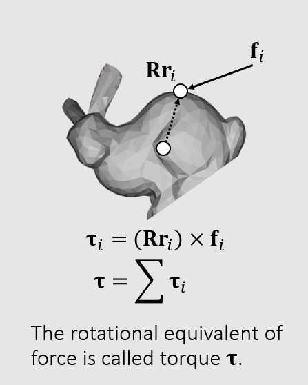
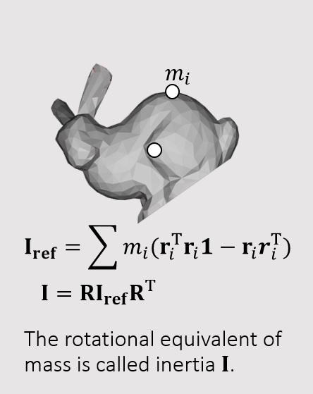
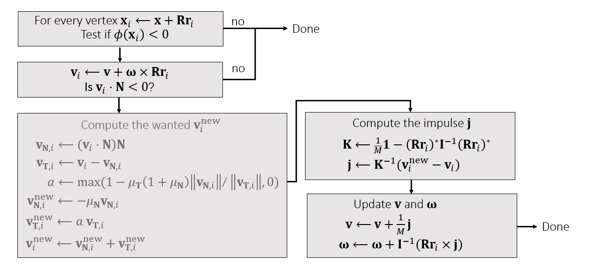

## Torque

$$
\tau_{i} = (Rr_{i}) \times f_{i}\\
\tau = \sum \tau_{i}
$$

## Inertia

- $\bold{I_{ref}}$ 为local space下的惯性张量
- Inertia Tensor是一个对称矩阵(symmetric matrix), 形式如下:
  $$
  \bold{I_{ref}} = \sum m_{i}\begin{bmatrix}
  r^{2}_{iy} + r^{2}_{iz} & -r^{2}_{ix}r^{2}_{iy} & -r^{2}_{ix}r^{2}_{iz} \\
  -r^{2}_{iy}r^{2}_{ix} & r^{2}_{ix} + r^{2}_{iz} & -r^{2}_{iy}r^{2}_{iz} \\
  -r^{2}_{iz}r^{2}_{ix} & -r^{2}_{iz}r^{2}_{iy} & r^{2}_{ix} + r^{2}_{iy} \\
  \end{bmatrix}
  $$

## Update Translational and Rotational Motion

### Translational motion

$$

\bold{v}[1] = \bold{v}[0] + \Delta t M^{-1} \bold{f}[0] \\
\bold{x}[1] = \bold{x}[0] + \Delta t \bold{v}[0]

$$

### Rotational motion

$$

\bm{\omega}[1] = \bm{\omega}[0] + \Delta t (\bold{I}[0])^{-1} \bm{\tau}[0] \\
\bm{q}[1] = \bm{q}[0] + [0 \quad \frac{\Delta t}{2} \bm{\omega[1]}] \times \bm{q}[0]

$$

## Rigid Body Collision by Impulse

- 逐顶点检测sdf值 $\phi(\bm{x_{i}})$
- 逐顶点检测速度v与平面法线的夹角
- 若通过检测，计算顶点碰撞后的线速度v_new，通过线速度计算出冲量j
